<div align="center">

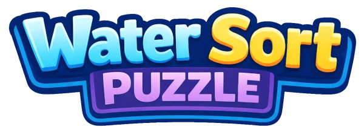

**A colorful sorting puzzle with 3D water.**<br>
Free, no ads, right in the browser — on a phone or a desktop.

### [▶ Play at evgeny.io/games/water-sort](https://evgeny.io/games/water-sort/)

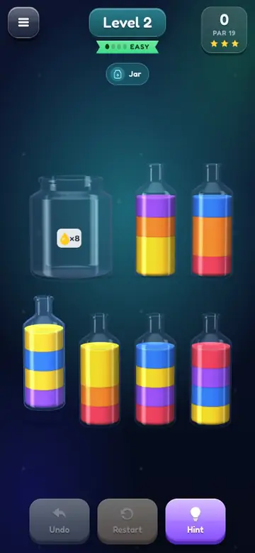
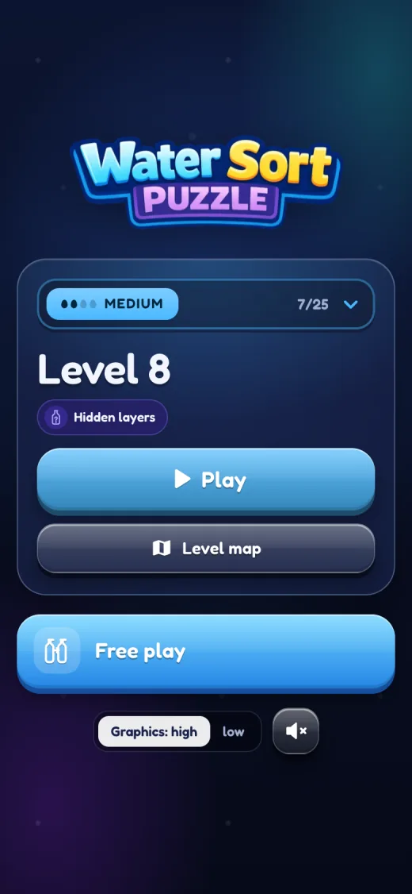
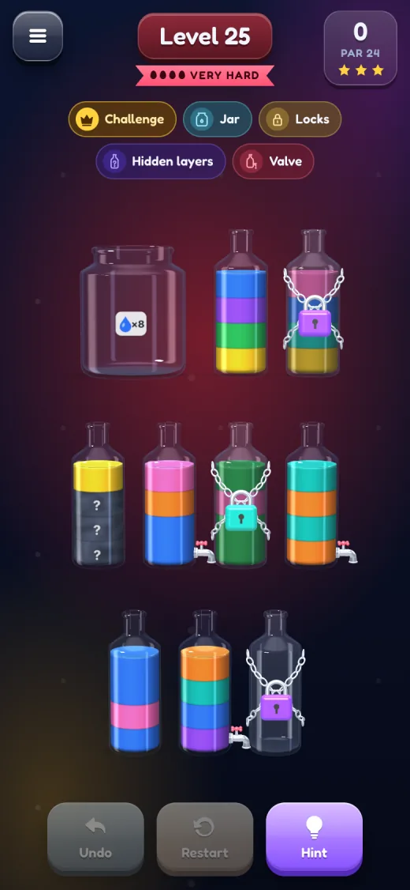

</div>

## How to play

Pour the colors from bottle to bottle until every bottle holds a single color. Tap a bottle to pick it up, then tap another to pour: the whole top layer of one color moves at once, as much as fits. Stuck? Undo and hints are free.

## Features

- **Water that behaves like water.** The liquid is a real volume inside the glass: a bottle tilts until the water reaches the lip, the surface stays level, and the stream, splashes, bubbles and corks are all animated.
- **Pick your difficulty.** Easy, Medium, Hard or Very hard — each is a track of 25 levels with its own progress. Difficulty rises gently along a track, and every 5th level is a challenge.
- **Six mechanics**, introduced early and combined as you go. Hidden layers can land on top of any of them.
- **Free play.** Any mechanic at any difficulty.
- **Stars for efficiency.** Solve a level in par for three stars; par is the proven optimum wherever the solver can prove it.

## Mechanics

<table>
  <tr>
    <td width="33%" align="center" valign="top">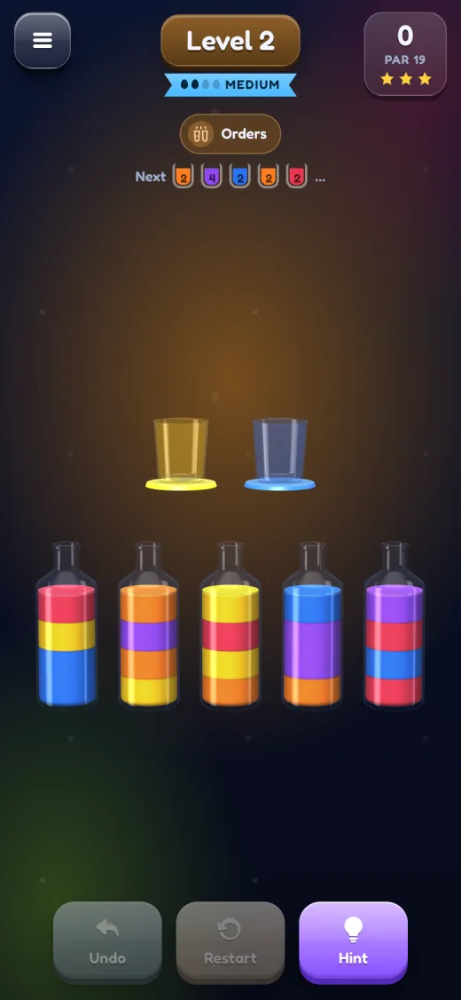<br><b>Orders</b><br>Fill each cup with its color as the orders arrive.</td>
    <td width="33%" align="center" valign="top">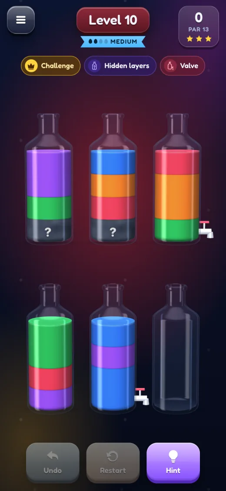<br><b>Valve</b><br>A bottle with a tap pours from the bottom: a queue, not a stack.</td>
    <td width="33%" align="center" valign="top">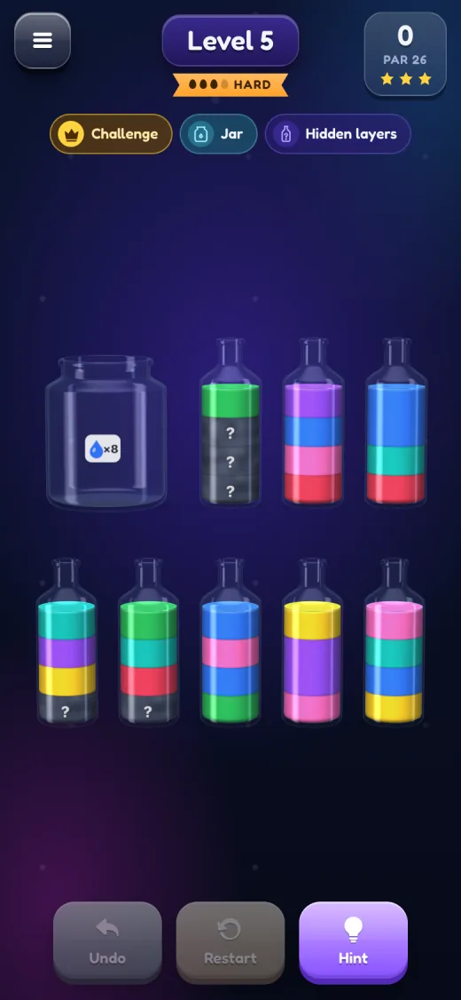<br><b>Jar + hidden layers</b><br>The jar takes 8 portions of one color; a “?” hides a color until it reaches the top.</td>
  </tr>
</table>

| Mechanic | How it works |
|---|---|
| **Jar** | Holds 8 portions of the color on its label. Nothing pours out of it. |
| **Orders** | Cups arrive one by one; fill each with its color. No sorting needed. |
| **Locks** | A chained bottle opens when you complete a bottle of the lock's color. |
| **Valve** | Pours its bottom layer, so it works like a queue. |
| **Mini flask** | Half a spare bottle, 2 portions. It has to end up empty. |
| **Hidden layers** | A “?” hides a color until that layer reaches the top. |

## More screens

<table>
  <tr>
    <td align="center">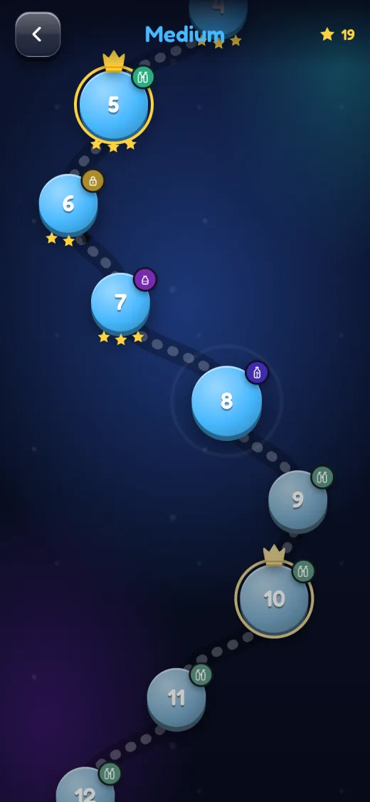<br>Level map</td>
    <td align="center">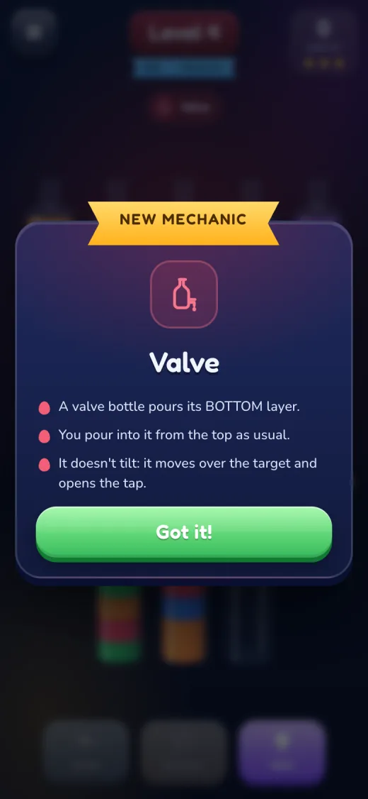<br>New mechanic</td>
    <td align="center">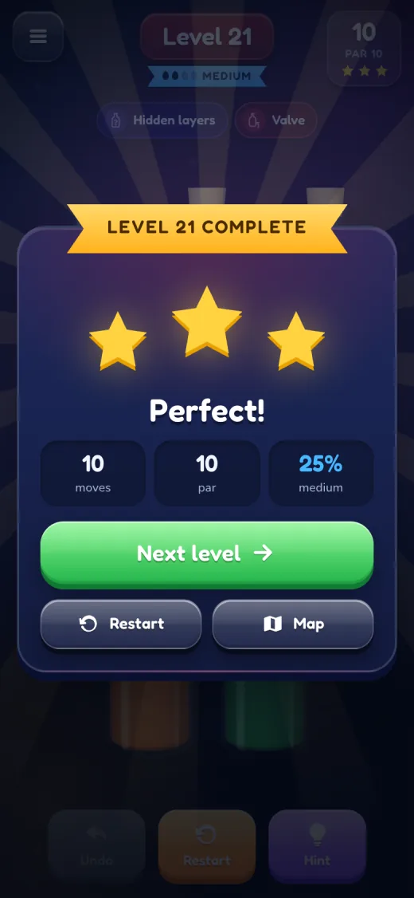<br>Level complete</td>
    <td align="center">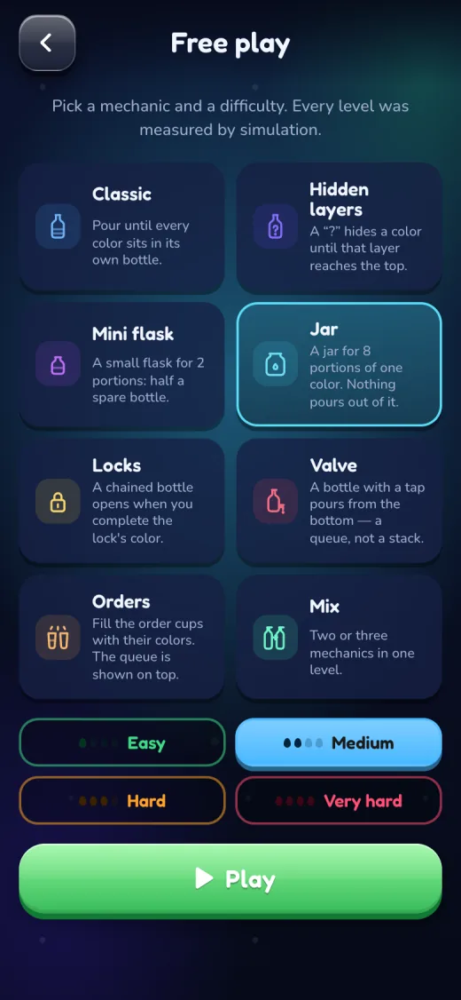<br>Free play</td>
  </tr>
</table>

## How the levels are made

Levels don't change between attempts: each one is generated once, checked by a solver and measured.

- **Difficulty is planning effort.** A search tries the natural moves first and backs out of dead ends, like a player using undo; the more positions it has to explore per move of the solution, the harder the level.
- **Hard levels are built, not found.** Random layouts are almost always easy by that measure, so harder levels get "hardened": portions are swapped between bottles while the level stays solvable and the effort climbs toward the target.
- **Every track follows a target curve**, and levels land on average within 2–3 points of it.

## Run it locally

```bash
cd lab
npm install
npm run dev        # http://localhost:5180
```

The level builders and the difficulty report are described in [lab/README.md](lab/README.md).

## Project layout

| Path | What's there |
|---|---|
| [`lab/`](lab/) | The game: TypeScript, Three.js and Vite, plus the engine, solver and level builders |
| [`src/`](src/) | The previous React version, kept for reference and no longer deployed |
| [`docs/screenshots/`](docs/screenshots/) | Images for this README |
| [`.github/workflows/deploy.yml`](.github/workflows/deploy.yml) | Builds `lab/` and publishes it to evgeny.io on every push to `main` |
